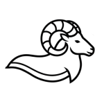

 
# MUFLON: Matrix Utility for Intuitionistic Fuzzy Relational Equations

MUFLON is a Python library for computations with intuitionistic fuzzy values and intuitionistic fuzzy relational systems of equations. 

The library treats an intuitionistic fuzzy value as a pair


$$(\mu,\nu)\in L^*,\qquad L^*=\{(\mu,\nu)\in[0,1]^2:\mu+\nu\le 1\}.$$


The first coordinate $(\mu)$ is the membership degree, and the second coordinate $(\nu)$ is the non-membership degree. Every input and output pair should satisfy the condition

$$\mu+\nu\le 1.$$

## Mathematical model

The library supports intuitionistic fuzzy relational systems of the form

$$A^{\vee,*}_{\wedge,\diamond}\circ x=b.$$

The system is decomposed into two fuzzy relational systems:

$$\max_j(a^{\mu}_{ij}*x^{\mu}_j)=b^{\mu}_i,$$

and

$$\min_j(a^{\nu}_{ij}\diamond x^{\nu}_j)=b^{\nu}_i.$$

Here (*) is the membership operation and $(\diamond)$ is the non-membership operation. In the most common cases, $(*)$ is a t-norm and $(\diamond)$ is its dual t-conorm, for example $(T_M,S_M)$, $(T_P,S_P)$, or $(T_L,S_L)$. More generally, the operations should satisfy the assumptions required for the corresponding fuzzy relational equation.

## Data format

MUFLON works with CSV files in which each cell contains one intuitionistic fuzzy value.

Example:

```text
0.3, 0.4; 0.2, 0.1; 0.5, 0.2
0.7, 0.1; 0.6, 0.2; 1.0, 0.0
```

The semicolon `;` separates columns. The comma `,` separates the membership and non-membership coordinates inside a cell. Decimal numbers should use a dot.

Recommended parsing function:

```python
from muflon.data_io import parse_ifs_csv_to_components

membership_matrix, nonmembership_matrix = parse_ifs_csv_to_components(df)
```

## Composition of intuitionistic fuzzy matrices

For the membership component, the composition is

$$C^{\mu}_{ik}=\max_j(a^{\mu}_{ij}*b^{\mu}_{jk}).$$

For the non-membership component, the composition is

$$C^{\nu}_{ik}=\min_j(a^{\nu}_{ij}\diamond b^{\nu}_{jk}).$$

Recommended usage:

```python
from muflon.ifs_operators import get_operator
from muflon.ifs_operations import (
    compose_component_matrices,
    combine_components_to_ifs,
    validate_l_star_condition,
)

membership_operation = get_operator("T_M")
nonmembership_operation = get_operator("S_M")

membership_result = compose_component_matrices(
    A_mu,
    B_mu,
    component_ops=[membership_operation],
    aggregation=np.max,
)

nonmembership_result = compose_component_matrices(
    A_nu,
    B_nu,
    component_ops=[nonmembership_operation],
    aggregation=np.min,
)

ifs_matrix = combine_components_to_ifs(membership_result, nonmembership_result)
is_valid, sums = validate_l_star_condition(membership_result, nonmembership_result)
```

The high-level function

```python
compose_ifs_matrices(...)
```

computes both components and returns a matrix of intuitionistic fuzzy pairs. The result should still be checked with `validate_l_star_condition()`.

## Solving the decomposed system

For the membership system

$$\max_j(a^{\mu}_{ij}*x^{\mu}_j)=b^{\mu}_i,$$

the candidate for the greatest membership solution is computed by the induced implication:

$$u^{\mu}_j=\min_i(a^{\mu}_{ij}\to_* b^{\mu}_i).$$

For the non-membership system

$$\min_j(a^{\nu}_{ij}\diamond x^{\nu}_j)=b^{\nu}_i,$$

the corresponding component is computed by the dual induced implication:

$$z^{\nu}_j=\max_i(a^{\nu}_{ij}\leftarrow_\diamond b^{\nu}_i).$$

Recommended usage:

```python
from muflon.ifs_operators import get_operator
from muflon.ifs_operations import (
    solve_component_system,
    solve_ifs_system_candidate,
    validate_l_star_condition,
)

induced_implication_mu = get_operator("IMP_T_M")
dual_induced_implication_nu = get_operator("DIMP_S_M")

greatest_membership_solution = solve_component_system(
    A_mu,
    b_mu,
    induced_implication_mu,
    aggregation=np.min,
)

least_nonmembership_solution = solve_component_system(
    A_nu,
    b_nu,
    dual_induced_implication_nu,
    aggregation=np.max,
)

is_valid, sums = validate_l_star_condition(
    greatest_membership_solution,
    least_nonmembership_solution,
)
```

The term `least_nonmembership_solution` means the least solution of the non-membership component in the usual order on $([0,1])$. Together with the greatest membership solution it forms a candidate for the greatest solution in the intuitionistic order. This candidate must satisfy the $(L^*)$ condition.

## Available operators

|Meaning|Identifier|
|-|-|
|Minimum t-norm|`T_M`|
|Product t-norm|`T_P`|
|Łukasiewicz t-norm|`T_L`|
|Drastic t-norm|`T_D`|
|Fodor t-norm|`T_FD`|
|Maximum t-conorm|`S_M`|
|Probabilistic sum|`S_P`|
|Łukasiewicz t-conorm|`S_L`|
|Drastic sum|`S_D`|
|Fodor t-conorm|`S_FD`|
|Induced implication for `T_M`|`IMP_T_M`|
|Induced implication for `T_P`|`IMP_T_P`|
|Induced implication for `T_L`|`IMP_T_L`|
|Induced implication for `T_FD`|`IMP_T_FD`|
|Dual induced implication for `S_M`|`DIMP_S_M`|
|Dual induced implication for `S_P`|`DIMP_S_P`|
|Dual induced implication for `S_L`|`DIMP_S_L`|

## Reduced matrices and minimal component solutions

The reduced matrix is computed componentwise.
```python
A_reduced = compute_reduced_matrix(A, x_component, b_component, operator, mode="eq")
A_binary = binarize_reduced_matrix(A_reduced)
minimal_component_solutions = find_minimal_component_solutions(
    A,
    b_component,
    A_reduced,
    dual_implication,
    operator,
    mode="eq",
)
```

The function `find_minimal_component_solutions()` concerns one component system. It does not by itself produce the full family of intuitionistic fuzzy solutions. The full intuitionistic result must also satisfy the condition $(\mu+\nu\le 1)$.Important notes

1. A joined matrix of pairs is not automatically a valid intuitionistic fuzzy matrix. It is valid only if every pair satisfies $(\mu+\nu\le 1)$.
2. The membership component should use induced implications such as `IMP_T_M`, `IMP_T_P`, or `IMP_T_L`.
3. The non-membership component should use dual induced implications such as `DIMP_S_M`, `DIMP_S_P`, or `DIMP_S_L`.
4. The non-membership operation should be described as $(\diamond)$, not simply as an arbitrary s-conorm. In standard dual cases, $(\diamond)$ is the t-conorm dual to $(*)$.
5. If a complement transformation $(1-\nu)$ is used in an algorithm, it must be explicitly implemented and documented. Otherwise, the description should not claim that such a transformation is automatic.

